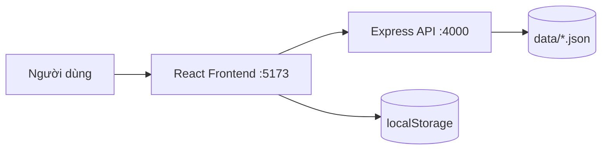
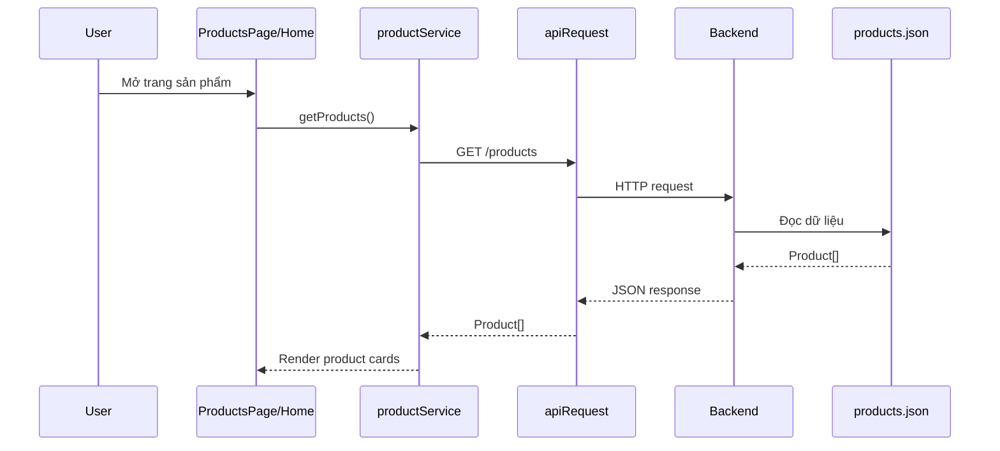
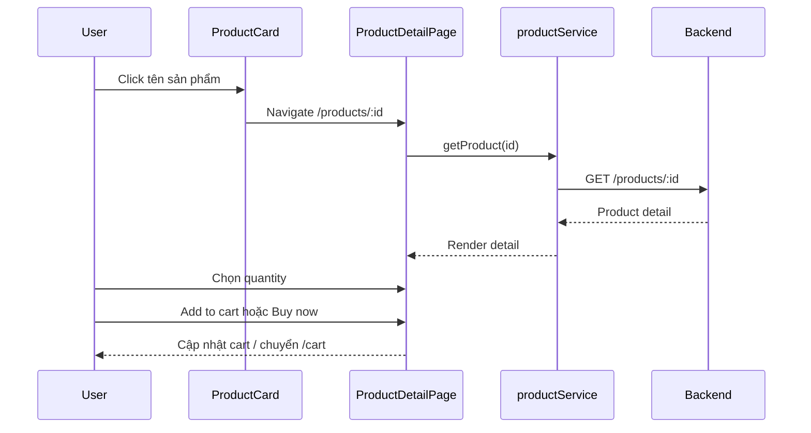
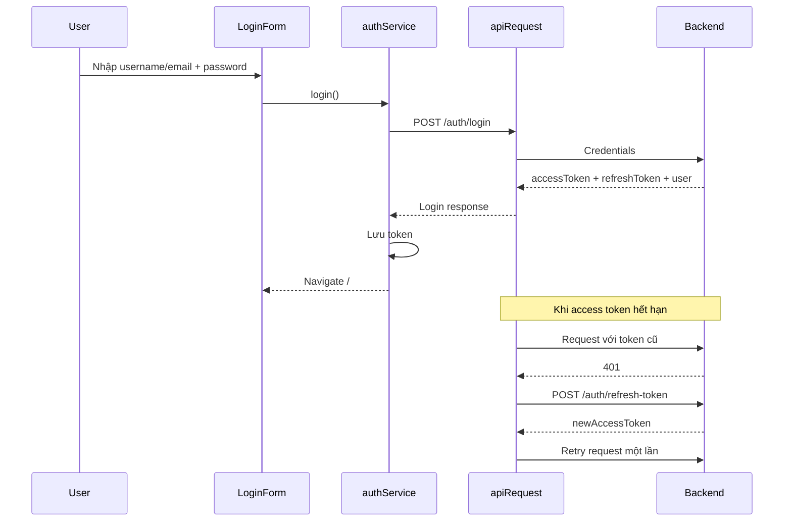

# E-commerce Project

Tài liệu này mô tả trạng thái hiện tại của toàn bộ workspace, các phần đã kết nối giữa frontend và backend, cách chạy dự án và các luồng nghiệp vụ đang có.

## 1. Tổng quan

Workspace gồm hai ứng dụng:

```text
Ecom NxDuc/
├── frontend/                    # React + TypeScript + Vite
├── javascript-basic-exercises/  # Node.js + Express mock REST API
└── PROJECT.md
```

Backend hiện dùng các file JSON như một database học tập. Frontend gọi backend qua HTTP cho sản phẩm và xác thực người dùng.



## 2. Công nghệ

### Frontend

- React 19
- TypeScript
- Vite
- React Router
- Tailwind CSS
- ESLint

### Backend

- Node.js
- Express
- JSON Web Token
- CORS
- File JSON làm data store

## 3. Cách chạy

Mở hai terminal riêng:

### Backend

```powershell
cd javascript-basic-exercises
npm install
npm start
```

Backend chạy tại:

```text
http://localhost:4000
```

### Frontend

```powershell
cd frontend
npm install
npm run dev
```

Frontend mặc định chạy tại:

```text
http://localhost:5173
```

Frontend dùng biến môi trường `VITE_API_URL` nếu có; nếu không, mặc định gọi:

```text
http://localhost:4000
```

Ví dụ tạo file `frontend/.env.local`:

```env
VITE_API_URL=http://localhost:4000
```

## 4. Cấu trúc chính

### Frontend

```text
frontend/src/
├── App.tsx                         # Router chính và CartProvider
├── Services/api.ts                 # HTTP client, token storage, refresh token
├── Layouts/MainLayout.tsx          # Header, navigation, breadcrumb, footer
├── Pages/
│   ├── home/                       # Trang chủ và các section sản phẩm
│   ├── products/                   # Listing, detail, product service/hooks
│   ├── auth/                       # Login, register, auth service
│   ├── cart/                       # CartProvider và cart page
│   ├── checkout/                   # Form checkout và validation
│   ├── account/                    # Trang tài khoản hiện tại
│   └── contact/                    # Trang liên hệ
└── mock/                           # Mock product cũ đã được loại bỏ
```

### Backend

```text
javascript-basic-exercises/
├── server.js
├── src/
│   ├── config.js
│   ├── db.js
│   ├── middleware/auth.js
│   └── routes/
│       ├── auth.routes.js
│       ├── products.routes.js
│       ├── users.routes.js
│       └── carts.routes.js
└── data/
    ├── products.json
    ├── users.json
    └── carts.json
```

## 5. Những phần đã làm

### 5.1. Kết nối product data

Frontend không còn import trực tiếp `data/products.json`.

Các file chính:

- `frontend/src/Services/api.ts`
- `frontend/src/Pages/products/_services/productService.ts`
- `frontend/src/Pages/products/_hooks/useProducts.ts`
- `frontend/src/Pages/products/_hooks/useProductDetail.ts`

Các API được dùng:

- `GET /products`
- `GET /products/:id`

Trang sản phẩm:

- `/products`: danh sách sản phẩm, tìm kiếm, lọc category
- `/products/:id`: chi tiết sản phẩm

Các card sản phẩm đã link tới route chi tiết động:

```text
/products/1
/products/2
/products/3
```

### 5.2. Kết nối authentication

Frontend đã có auth service gọi backend thật:

- Login: `POST /auth/login`
- Register: `POST /users`
- Logout service: `POST /auth/logout`
- Refresh token: `POST /auth/refresh-token`

Login hỗ trợ gửi username hoặc email. Backend đã được cập nhật để chấp nhận cả hai loại định danh.

Token được lưu ở một trong hai storage:

- `localStorage` khi chọn `Remember me`
- `sessionStorage` khi không chọn `Remember me`

Mỗi request qua `apiRequest()` sẽ:

1. Đọc access token.
2. Gắn header `Authorization: Bearer <token>`.
3. Nếu nhận `401`, gọi refresh token.
4. Retry request một lần với access token mới.
5. Nếu refresh thất bại, xóa thông tin auth.

Tài khoản mẫu trong backend:

| Username     | Email                  | Password   | Role       |
| ------------ | ---------------------- | ---------- | ---------- |
| `admin`      | `admin@techstore.com`  | `admin123` | `admin`    |
| `minhnguyen` | `nguyenminh@gmail.com` | `123456`   | `customer` |
| `quanghuy`   | `quanghuy@gmail.com`   | `123456`   | `customer` |

### 5.3. Cart dùng chung trong frontend

Cart được quản lý bởi `CartProvider` và hook `useCart()`.

Các component dùng chung một cart state:

- `ProductCard`
- `ProductActions` ở product detail
- `CartPage`
- `CheckoutPage`

Các thao tác hiện có:

- Thêm sản phẩm
- Tăng số lượng
- Giảm số lượng
- Xóa sản phẩm
- Chọn/bỏ chọn sản phẩm
- Chọn/bỏ chọn tất cả
- Xóa toàn bộ cart
- Tính subtotal
- Voucher `SAVE10`
- Tính discount, shipping và total

Cart được lưu tại localStorage với key:

```text
ecom-cart
```

### 5.4. Checkout

Checkout lấy trực tiếp các sản phẩm đang được chọn trong cart, không còn dùng danh sách sản phẩm giả.

Route:

```text
/checkout
```

Đã có:

- Form thông tin giao hàng
- Chọn phương thức thanh toán
- Validate dữ liệu
- Tính subtotal, discount, shipping fee và total
- Màn hình đặt hàng thành công
- Điều hướng quay lại cart hoặc tiếp tục mua sắm

### 5.5. Route frontend hiện tại

| Route           | Component           | Trạng thái                      |
| --------------- | ------------------- | ------------------------------- |
| `/`             | `HomePage`          | Hoạt động                       |
| `/products`     | `ProductsPage`      | Đã kết nối API                  |
| `/products/:id` | `ProductDetailPage` | Đã kết nối API                  |
| `/login`        | `LoginPage`         | Đã gọi auth API                 |
| `/register`     | `RegisterPage`      | Đã gọi users API                |
| `/cart`         | `CartPage`          | Dùng CartProvider               |
| `/checkout`     | `CheckoutPage`      | Dùng cart thật, submit mô phỏng |
| `/account`      | `AccountPage`       | Giao diện hiện tại còn mock     |
| `/contact`      | `ContactPage`       | Hoạt động giao diện             |

## 6. Backend API

### Authentication

| Method | Endpoint              | Mô tả                               | Quyền        |
| ------ | --------------------- | ----------------------------------- | ------------ |
| `POST` | `/auth/login`         | Đăng nhập, trả access/refresh token | Public       |
| `POST` | `/auth/refresh-token` | Cấp access token mới                | Public       |
| `POST` | `/auth/logout`        | Thu hồi refresh token               | Public       |
| `GET`  | `/auth/me`            | Lấy user hiện tại                   | Access token |

Access token hiện hết hạn sau 60 giây để dễ kiểm tra refresh flow. Refresh token hết hạn sau 7 ngày.

### Products

| Method   | Endpoint                           | Mô tả                 | Quyền  |
| -------- | ---------------------------------- | --------------------- | ------ |
| `GET`    | `/products`                        | Lấy toàn bộ sản phẩm  | Public |
| `GET`    | `/products/categories`             | Lấy category          | Public |
| `GET`    | `/products/category/:categoryName` | Lọc theo category     | Public |
| `GET`    | `/products/:id`                    | Lấy sản phẩm theo id  | Public |
| `POST`   | `/products`                        | Tạo sản phẩm          | Admin  |
| `PUT`    | `/products/:id`                    | Thay toàn bộ sản phẩm | Admin  |
| `PATCH`  | `/products/:id`                    | Cập nhật một phần     | Admin  |
| `DELETE` | `/products/:id`                    | Xóa sản phẩm          | Admin  |

### Users

| Method   | Endpoint     | Mô tả                       | Quyền                |
| -------- | ------------ | --------------------------- | -------------------- |
| `GET`    | `/users`     | Danh sách user, ẩn password | Admin                |
| `GET`    | `/users/:id` | Xem user                    | Chính chủ hoặc admin |
| `POST`   | `/users`     | Đăng ký user                | Public               |
| `PUT`    | `/users/:id` | Cập nhật toàn bộ user       | Chính chủ hoặc admin |
| `PATCH`  | `/users/:id` | Cập nhật một phần user      | Chính chủ hoặc admin |
| `DELETE` | `/users/:id` | Xóa user                    | Admin                |

### Carts backend

| Method   | Endpoint              | Mô tả             | Quyền        |
| -------- | --------------------- | ----------------- | ------------ |
| `GET`    | `/carts`              | Danh sách cart    | Public       |
| `GET`    | `/carts/user/:userId` | Cart theo user    | Public       |
| `GET`    | `/carts/:id`          | Cart theo id      | Public       |
| `POST`   | `/carts`              | Tạo cart          | Access token |
| `PUT`    | `/carts/:id`          | Thay cart         | Access token |
| `PATCH`  | `/carts/:id`          | Sửa một phần cart | Access token |
| `DELETE` | `/carts/:id`          | Xóa cart          | Access token |

## 7. Các luồng chính

### 7.1. Luồng tải danh sách sản phẩm



### 7.2. Luồng product detail



### 7.3. Luồng login và refresh token



### 7.4. Luồng cart và checkout

```mermaid
flowchart TD
    A[ProductCard hoặc ProductDetail] --> B[useCart addToCart]
    B --> C[CartProvider state]
    C --> D[localStorage: ecom-cart]
    C --> E[/cart]
    E --> F[Chọn sản phẩm]
    F --> G[/checkout]
    G --> H[Validate shipping form]
    H --> I[Tính subtotal/discount/shipping/total]
    I --> J[Hiển thị success hiện tại]
```

## 8. Kiểm tra dự án

Frontend đã được kiểm tra bằng:

```powershell
cd frontend
npm run lint
npm run build
```

Các kiểm tra đã đạt:

- TypeScript build thành công.
- Vite production build thành công.
- ESLint không còn lỗi.
- `GET http://localhost:4000/products` trả HTTP 200.
- Login bằng user mẫu hoạt động.

Build hiện còn một warning CSS từ stylesheet hiện tại, không làm build thất bại.

## 9. Những phần chưa hoàn thiện

### 9.1. Order API chưa có

Backend chưa có route `/orders`, nên checkout hiện chỉ:

- Validate form.
- Tính tiền.
- Hiển thị trạng thái thành công.
- Xóa cart localStorage ở phía frontend.

Chưa có lưu đơn hàng thật vào backend.

### 9.2. Cart frontend chưa đồng bộ backend

Backend có `/carts`, nhưng frontend hiện dùng localStorage vì contract cart backend chưa có cơ chế ownership đủ chặt theo user và chưa được nối vào CartProvider.

Để hoàn thiện cần:

1. Bắt buộc user đăng nhập trước khi checkout.
2. Thiết kế cart theo `userId` hoặc token hiện tại.
3. Đồng bộ create/update/delete cart qua API.
4. Xử lý merge cart local với cart server sau login.

### 9.3. Account/profile còn mock

`AccountPage` và `ProfileForm` hiện vẫn hiển thị dữ liệu mẫu. Có thể hoàn thiện bằng cách:

1. Gọi `GET /auth/me` khi mở account.
2. Map `name`, `email`, `phone`, `address` vào form.
3. Gọi `PATCH /users/:id` khi lưu.
4. Thêm protected route cho account.

### 9.4. Header actions chưa hoàn chỉnh

Một số icon trên header mới là giao diện, chưa nối đầy đủ:

- Account icon chưa điều hướng theo trạng thái login.
- Cart badge chưa lấy số lượng từ `useCart`.
- Logout UI chưa được gắn vào header.

## 10. Ghi chú backend

Backend là mock server phục vụ học tập/test, chưa phù hợp production:

- Password đang lưu plaintext trong JSON.
- Refresh token lưu trong RAM, restart server sẽ mất token.
- JSON database không xử lý race condition khi ghi đồng thời.
- Secret mặc định đang có trong code nếu chưa cấu hình biến môi trường.

## 11. Hướng phát triển đề xuất

1. Thêm `orders.routes.js` và `orders.json`.
2. Đồng bộ cart frontend với `/carts`.
3. Hoàn thiện auth context và protected routes.
4. Nối account/profile với `/auth/me` và `/users/:id`.
5. Nối logout vào header.
6. Thêm loading/error boundary thống nhất.
7. Thêm test cho API client, auth refresh và cart reducer/state.
8. Khi chuyển production, thay JSON database bằng database thật và hash password bằng bcrypt.
